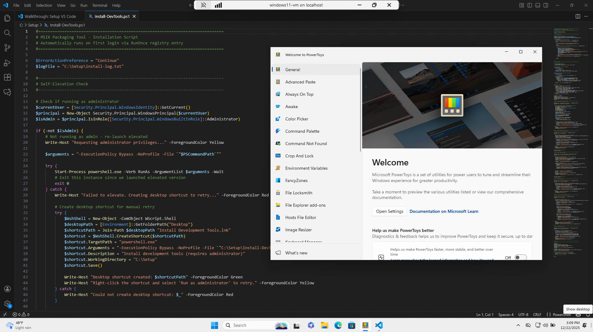

# Windows 11 Development VM Setup Script

Automated PowerShell script for creating fully-configured Windows 11 virtual machines with pre-installed development tools or MSIX packaging environment.

## Overview

This script creates a bootable Windows 11 Hyper-V virtual machine using the VHD approach, eliminating the need for manual Windows installation. The VM boots directly into Windows with all development tools or MSIX packaging tools automatically installed on first login.

<p align="center">
  
</p>

### Key Features

- **Zero Manual Setup**: No Windows installation wizard - boots straight to desktop
- **Automated Tool Installation**: Development tools or MSIX Packaging Tool installed automatically
- **Two VM Types**: 
  - **DevVM**: Full development environment with VS Code, Git, PowerShell 7, WSL, Visual Studio, etc.
<p align="center">
  
</p>


  - **MSIXPackagingTool**: Optimized MSIX packaging environment with system maintenance disabled
<p align="center">
  
</p>

- **TPM & Secure Boot Bypass**: Pre-configured to bypass Windows 11 hardware requirements
- **Quick Update Mode**: Update scripts in existing VHD without rebuilding
- **Nested Virtualization**: WSL support enabled for development VMs

## Prerequisites

- **PowerShell 7+** (script automatically checks and prompts for upgrade)
- **Hyper-V** enabled with administrator privileges
- **Windows 11 ISO** (auto-downloaded if not present)
- **Disk Space**: ~25-30 GB for VHD + ISO
- **Memory**: Recommended 8GB RAM on host machine

## First Boot - User Account Setup
Both images by default will be user Admin and password Password123!. It is recommended that you change that.

**For DevVM:**
- Create a local account or use Microsoft account
- Use a strong password (required for WSL setup)
- Administrator privileges are automatic (first user account)

**For MSIX Packaging VM:**
- Local account recommended for isolated packaging environment
- Simple password acceptable (VM is typically temporary/isolated)
- Administrator privileges required for MSIX Packaging Tool

## Usage

### Basic Syntax

```powershell
.\Setup-Windows11VM-VHD.ps1 [-VMName <string>] [-ImageType <string>] [parameters...]
```

### Parameters

| Parameter | Type | Default | Description |
|-----------|------|---------|-------------|
| `VMName` | String | `"Windows11-Dev-VM"` | Name of the virtual machine |
| `ImageType` | String | `"DevVM"` | VM type: `"DevVM"` or `"MSIXPackagingTool"` |
| `IsoPath` | String | `"$env:USERPROFILE\Downloads\Win11.iso"` | Path to Windows 11 ISO file |
| `VMPath` | String | `"C:\temp\vm"` | Directory where VM files will be stored |
| `VHDSizeBytes` | UInt64 | `64GB` | Virtual hard disk size |
| `MemoryStartupBytes` | UInt64 | `8GB` | VM memory allocation |
| `SwitchName` | String | Auto-detect | Hyper-V network switch name |
| `WinGetConfigPath` | String | Auto-detect | Path to WinGet DSC configuration file |
| `UpdateScriptsOnly` | Switch | `$false` | Update scripts in existing VHD without rebuilding |
| `DebugLogging` | Switch | `$false` | Enable detailed debug logging |

### Examples

#### Create Development VM

```powershell
.\Setup-Windows11VM-VHD.ps1 -VMName "MyDevVM" -ImageType "DevVM"
```

#### Create MSIX Packaging VM

```powershell
.\Setup-Windows11VM-VHD.ps1 -VMName "MSIX-PackagingVM" -ImageType "MSIXPackagingTool"
```

#### Update Scripts in Existing VM

```powershell
.\Setup-Windows11VM-VHD.ps1 -VMName "MyDevVM" -ImageType "DevVM" -UpdateScriptsOnly
```

#### Custom Configuration

```powershell
.\Setup-Windows11VM-VHD.ps1 `
    -VMName "CustomVM" `
    -ImageType "DevVM" `
    -VHDSizeBytes 100GB `
    -MemoryStartupBytes 16GB `
    -IsoPath "D:\ISOs\Win11.iso"
```

## VM Types

### DevVM - Development Environment

**Installed Tools:**
- PowerShell 7 (latest)
- Visual Studio Code
- Git for Windows
- Windows Terminal
- PowerToys
- Visual Studio 2022 Community
- Windows Subsystem for Linux (WSL)
- Ubuntu distribution (post-reboot)

**Features:**
- Developer Mode enabled
- Nested virtualization for WSL
- Automatic restart prompt for WSL completion
- Post-reboot Ubuntu installation

### MSIXPackagingTool - MSIX Packaging Environment

**Installed Tools:**
- MSIX Packaging Tool
- MSIX Packaging Tool Driver (Feature on Demand)

**System Optimizations:**
- Windows Update tasks disabled
- Windows Store updates disabled
- Disk defragmentation disabled
- Application Experience tasks disabled
- CEIP telemetry disabled
- System maintenance tasks disabled
- Windows Defender tasks commented out (security preserved)

**Purpose:** Creates a stable, interference-free environment for reliable MSIX package creation.

## How It Works

### 1. Prerequisites Check
- Validates administrator privileges
- Checks PowerShell 7+ requirement
- Enables Hyper-V if needed

### 2. ISO Acquisition
- Downloads Windows 11 ISO if not present
- Extracts `install.wim` from ISO

### 3. VHD Creation
- Creates bootable VHDX with Windows 11
- Applies unattend.xml for automated setup
- Bypasses TPM and Secure Boot requirements
- Configures UEFI boot

### 4. Script Injection
- Creates `C:\Setup\Install-DevTools.ps1` inside VHD
- Creates `C:\Setup\configuration.dsc.yaml` with WinGet DSC configuration
- Adds startup triggers (batch file + RunOnce registry)

### 5. VM Creation
- Creates Generation 2 Hyper-V VM
- Configures TPM 2.0
- Sets up dynamic memory
- Enables nested virtualization (for DevVM)
- Attaches VHD and configures boot order

### 6. First Boot Installation
On first VM login, `Install-DevTools.ps1` automatically:
- Waits for WinGet to be available
- Updates WinGet to latest version
- Runs WinGet DSC configuration
- Installs all packages (with certificate bypass if needed)
- Configures system settings (DevVM: WSL, MSIX: task disabling)
- Creates desktop shortcuts
- Prompts for restart (DevVM only, for WSL completion)

### 7. Post-Reboot (DevVM Only)
After restart:
- Automatically installs Ubuntu distribution
- Shows complete list of installed tools
- Pauses for user acknowledgment


## Troubleshooting

### Common Issues

**Script Requires PowerShell 7**
```powershell
# Install PowerShell 7
winget install Microsoft.PowerShell
# or
Invoke-Expression "& { $(Invoke-RestMethod https://aka.ms/install-powershell.ps1) } -UseMSI"
```

**VHD File In Use**
```powershell
# Stop the VM first
Stop-VM -Name "YourVMName" -Force
# Then run script again
```

**Installation Script Not Running in VM**
- Check `C:\Setup\install-log.txt` in the VM
- Manually run: `C:\Setup\Install-DevTools.ps1` as Administrator
- Verify startup batch exists: `C:\ProgramData\Microsoft\Windows\Start Menu\Programs\StartUp\Install-DevTools.bat`

**WinGet Not Available**
- Wait 5-10 minutes after first boot for Windows Store to deploy App Installer
- Check Windows Update for pending updates
- Manually install App Installer from Microsoft Store

**Certificate Validation Error (0x8A15005E)**
- Script automatically handles this with certificate bypass
- Check log for retry attempts
- Ensure VM has internet connectivity

**WSL Installation Fails**
- Restart required after WSL install
- Script prompts automatically
- Nested virtualization must be enabled (automatically configured)

### Quick Update Mode

If you need to modify the installation scripts without rebuilding the entire VHD:

```powershell
.\Setup-Windows11VM-VHD.ps1 -VMName "ExistingVM" -ImageType "DevVM" -UpdateScriptsOnly
```

This will:
1. Stop VM if running
2. Mount VHD
3. Update `Install-DevTools.ps1` and `configuration.dsc.yaml`
4. Update RunOnce triggers
5. Dismount VHD
6. Optionally restart VM

### Debug Mode

Enable detailed logging for troubleshooting:

```powershell
.\Setup-Windows11VM-VHD.ps1 -VMName "DebugVM" -ImageType "DevVM" -DebugLogging
```

Debug logs include:
- Function entry/exit points
- File creation verification
- VHD mount/dismount operations
- Script injection details

## Advanced Customization

### Modify Installed Packages

Edit the `configuration.dsc.yaml` generation in the script (function `Add-WinGetDSC`):

```powershell
# Add more packages to DevVM
resources:
  - resource: Microsoft.WinGet.DSC/WinGetPackage
    directives:
      description: Install Docker Desktop
    settings:
      id: Docker.DockerDesktop
      source: winget
```

### Custom Unattend.xml

Modify the `Create-UnattendXML` function to add your own configuration:

```powershell
function Create-UnattendXML {
    # Add custom FirstLogonCommands
    # Modify TimeZone, Locale, etc.
}
```

### Network Configuration

Specify a different Hyper-V switch:

```powershell
.\Setup-Windows11VM-VHD.ps1 -SwitchName "External Switch"
```

## System Requirements

### Minimum
- Windows 10/11 Pro or Enterprise (for Hyper-V)
- 8GB RAM
- 50GB free disk space
- Virtualization enabled in BIOS

### Recommended
- Windows 11 Pro
- 16GB+ RAM
- SSD with 100GB+ free space
- Internet connection for package downloads

## Security Considerations

### MSIX VM Type
- Windows Defender tasks are **commented out by default**
- System remains protected with real-time scanning active
- Only scheduled maintenance tasks are disabled
- Consider adding folder exclusions instead of disabling

### DevVM Type
- All security features remain enabled
- Developer Mode enabled (required for WSL/development)
- No security-related services disabled

### Network Isolation
- VMs use Hyper-V switch for network access
- Can be configured for isolated network testing
- Default: shares host network connection

## Logs and Diagnostics

**Installation Log** (inside VM)
```
C:\Setup\install-log.txt
```

Contains:
- Timestamp for all operations
- WinGet output and exit codes
- Package installation status
- Error messages and warnings

**Host Script Output**
- Real-time progress in PowerShell console
- Color-coded status messages
- Debug information (if enabled)

## Updates and Maintenance

### Updating Existing VM

1. **Scripts Only**:
   ```powershell
   .\Setup-Windows11VM-VHD.ps1 -VMName "MyVM" -UpdateScriptsOnly
   ```

2. **Full Rebuild**:
   - Stop and remove VM
   - Delete VHD
   - Run setup script again

### Windows Updates in VM

**DevVM**: Normal Windows Update enabled (recommended)

**MSIX VM**: Windows Update tasks disabled for stability
- Manually run updates when not packaging
- Re-enable tasks temporarily if needed:
  ```powershell
  Enable-ScheduledTask -TaskName "\Microsoft\Windows\WindowsUpdate\Scheduled Start"
  ```

## License

This script is provided as-is for creating Windows development environments. Windows 11 licensing requirements apply to the created VMs.

## Contributing

For issues, suggestions, or improvements, please refer to the script header comments for version history and authorship information.

## Version History

See script file header for detailed version history and changelog.

---

**Quick Start**: Run with defaults for DevVM
```powershell
.\Setup-Windows11VM-VHD.ps1
```

**Quick Start**: MSIX Packaging VM
```powershell
.\Setup-Windows11VM-VHD.ps1 -ImageType "MSIXPackagingTool"
```
